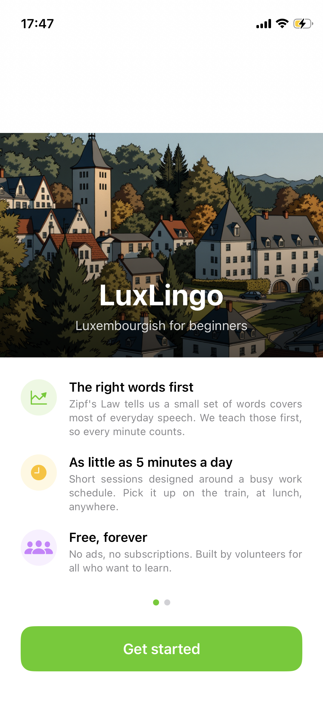
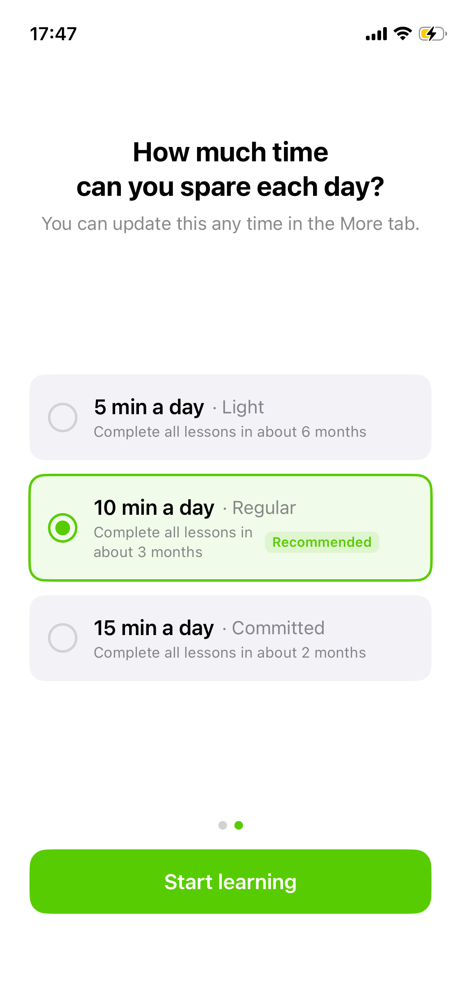
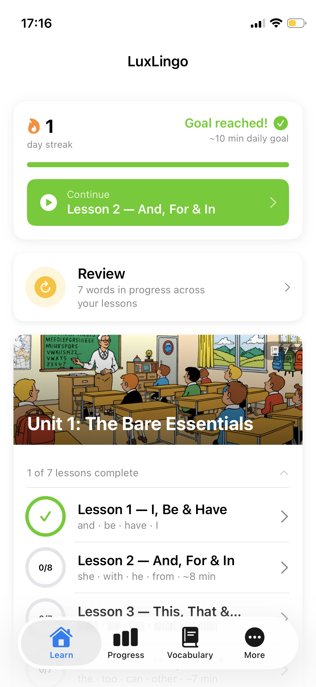
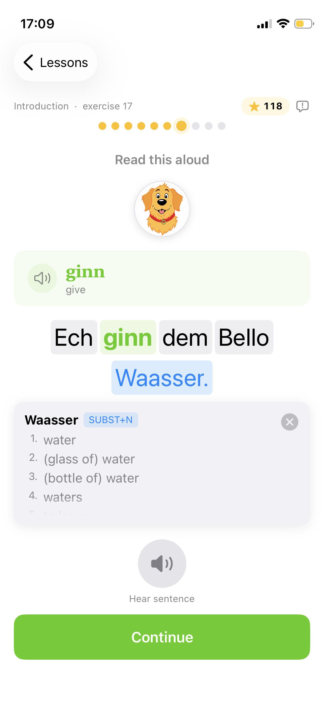
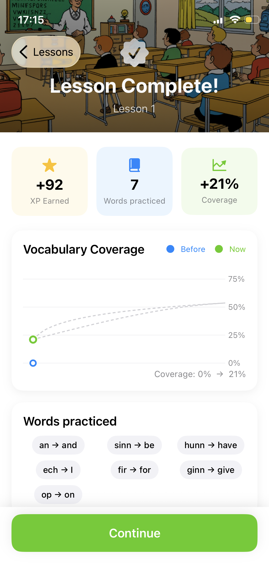
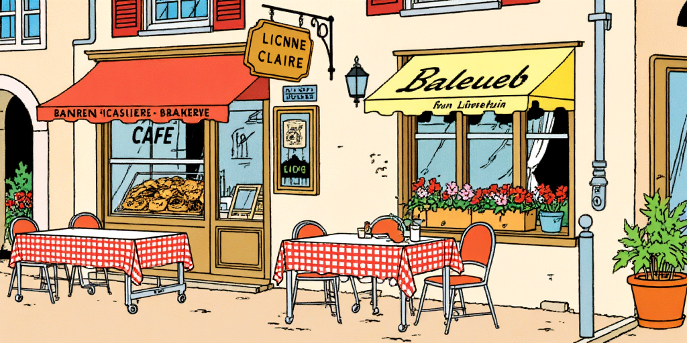

# LuxLingo — Luxembourgish for Beginners

**Free · Ad-free · No subscriptions · No limits**

LuxLingo makes it genuinely easy to start learning Luxembourgish — built for busy people who want to connect with Luxembourg's national language but don't have hours to spare.

[](LICENSE)
[](https://creativecommons.org/licenses/by-nc/4.0/)
[](https://apple.com/ios)
[](https://swift.org)

---

## Screenshots

<table>
  <tr>
    <td align="center"><br/><sub>Welcome — first launch</sub></td>
    <td align="center"><br/><sub>Set your daily goal</sub></td>
    <td align="center"><br/><sub>Home — streak, units, lessons</sub></td>
    <td align="center"><br/><sub>Exercise — tap any word to look it up</sub></td>
    <td align="center"><br/><sub>Lesson complete — XP and Zipf coverage gain</sub></td>
  </tr>
</table>

---

## Why LuxLingo?

Luxembourg is home to over 680,000 residents — a large share of whom are international professionals who want to connect with the local language but can't find a practical way in. Existing resources assume you're a student with hours to spare. Textbooks are expensive. Classes have fixed schedules.

LuxLingo is different. **5 minutes a day is enough to start.** Sessions are short, adaptive, and designed around a full working day. Pick it up on the train, at lunch, anywhere.

And it will always be completely free — no ads, no paywalls, no premium tier.

---

## Built on Zipf's Law

In every language, a tiny handful of words does most of the heavy lifting. The most common word appears roughly twice as often as the second most common, three times as often as the third — and so on. This is Zipf's Law.

**Just 500 words cover approximately 80% of everyday Luxembourgish conversation.**

LuxLingo teaches those words first — so every minute of practice delivers the maximum real-world benefit. Luxembourgish has a particular advantage here: with around 600,000 native speakers, its active vocabulary is smaller than French, German, or English, making the frequency-first approach especially powerful.

| Vocabulary taught | Coverage of everyday speech |
|---|---|
| Top 10 words | ~25% |
| Top 100 words | ~50% |
| Top 500 words | ~80% |

The **My Progress** tab shows a live Zipf coverage curve — so you can see exactly how much of real Luxembourgish text your current vocabulary covers.

---

## What's Inside

| | |
|---|---|
| 📚 Core vocabulary words | 468 |
| 📝 Example sentences | 7,662 |
| 🎓 Structured lessons | 70 core · 4 bonus |
| 🧠 Exercise types | 12 |
| 🔊 Native TTS pronunciation | Sproochmaschinn.lu |
| 📖 In-app dictionary lookup | LOD.lu |
| 🎙️ Pronunciation scoring | LuxASR |

---

## 12 Exercise Types

Exercises unlock progressively as your mastery grows — starting simple, building to full production:

| Exercise | What it trains |
|---|---|
| Flashcard | Recognition — see word, translation, example sentence |
| Reading | Comprehension — tap any word for its dictionary meaning |
| Multiple Choice | Meaning recall in context |
| Fill in the Blank | Written production (cloze) |
| Build the Sentence | Word-order awareness |
| Listening | Audio recognition — no text shown |
| Audio Dictation | Spelling from audio |
| N-Rule Hunter | The Eifeler Regel (Luxembourgish's n-rule) |
| Verb Forms | Conjugation table completion |
| Conjugation Match | Suppletive verb recognition (sinn → ass etc.) |
| Speed Round | Swipe-based fluency drilling |
| Match the Pairs | Rapid vocabulary association |

---

## Meet the Characters

All 7,662 example sentences follow eight recurring characters living in Luxembourg — making vocabulary feel grounded in real life rather than abstract lists.

<table>
  <tr>
    <td align="center"><br/><b>Marc</b><br/><sub>Age 8 · Mecher</sub></td>
    <td align="center"><br/><b>Anna</b><br/><sub>Age 11 · Germany</sub></td>
    <td align="center"><br/><b>Paul</b><br/><sub>Age 12 · Germany</sub></td>
    <td align="center"><br/><b>Lena</b><br/><sub>Age 11 · Belgium</sub></td>
    <td align="center"><br/><b>Claire</b><br/><sub>Age 11 · bookworm</sub></td>
    <td align="center"><br/><b>Natali</b><br/><sub>Age 5 · neighbour</sub></td>
    <td align="center"><br/><b>Här Weiss</b><br/><sub>Teacher</sub></td>
    <td align="center"><br/><b>Bello</b><br/><sub>Anna's dog</sub></td>
  </tr>
</table>

---

## Scenes

Lessons are set across 21 illustrated locations in and around a Luxembourgish village — from the classroom and café to the train station and the river in winter.

<table>
  <tr>
    <td></td>
    <td></td>
    <td></td>
  </tr>
</table>

---

## Architecture

LuxLingo is a **content delivery engine** — the entire curriculum lives in a single JSON seed file. A new Luxembourgish curriculum from any teacher or institution can be deployed with zero code changes: produce a valid `initial_seed.json` and the app delivers it with all 12 exercise types, spaced repetition, audio, and dictionary lookup working automatically.

```
initial_seed.json  →  SwiftData (on-device)  →  ExerciseViewModel  →  SwiftUI
      ↑                                                ↑
  468 words                                     mastery 0–20
  7,662 sentences                               12 exercise types
  70 lessons                                    spaced repetition
```

**Tech stack:** Swift 5.9 · SwiftUI · SwiftData · iOS 17+ · AVFoundation · async/await

**External services:**
- [LOD.lu](https://lod.lu) — Lëtzebuerger Online Dictionnaire (word lookup + audio)
- [Sproochmaschinn.lu](https://sproochmaschinn.lu) — Luxembourgish text-to-speech
- [LuxASR](https://clarin.uni.lu/luxasr) — Pronunciation scoring (University of Luxembourg)
- [LuxMT](https://clarin.uni.lu/luxmt) — Machine translation (University of Luxembourg)

---

## Contributing

**Native Luxembourgish speaker?**
The most valuable contribution is sentence review and correction. We provide a structured spreadsheet and a clear review process. Email [luxlingo.app@gmail.com](mailto:luxlingo.app@gmail.com) to get involved.

**Educator or institution?**
LuxLingo is built as open infrastructure. A new curriculum in the seed format can be published to thousands of phones for free, with no app development required. Get in touch to discuss content partnerships.

**Developer?**
PRs are welcome. See [CLAUDE.md](CLAUDE.md) for full architecture documentation, the data model, and content pipeline details.

---

## Licence

- **Code:** [MIT](LICENSE) — free to use, modify, and build on with attribution
- **Content** (lessons, sentences, vocabulary data): [CC BY-NC 4.0](https://creativecommons.org/licenses/by-nc/4.0/) — free for non-commercial use with attribution

---

## Created by

**Vinay Arun** — Product Manager · volunteer developer

[luxlingo.app@gmail.com](mailto:luxlingo.app@gmail.com)

*LuxLingo is a volunteer project. If it's helped you learn Luxembourgish, you're welcome to [buy me a coffee ☕](https://ko-fi.com/vinayarun) — entirely optional, and the app will always be free regardless.*
