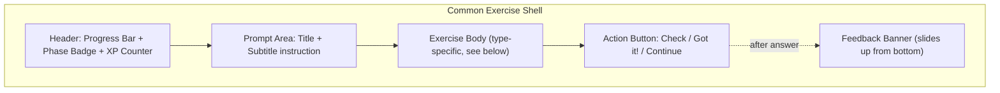
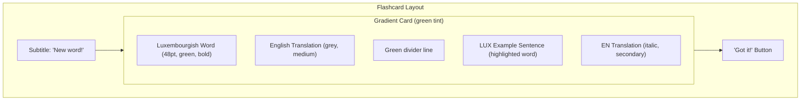
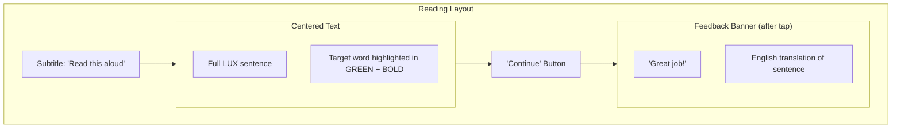
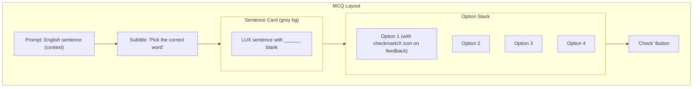
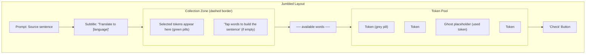
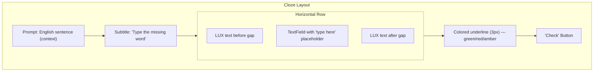
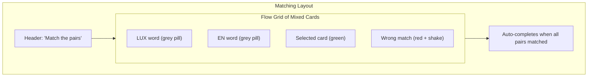
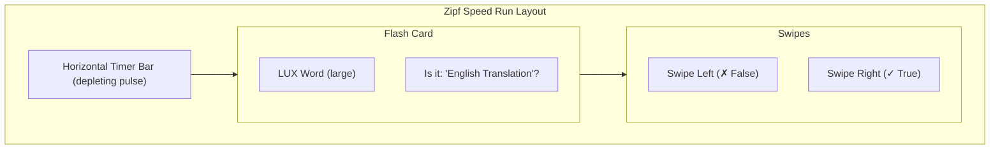
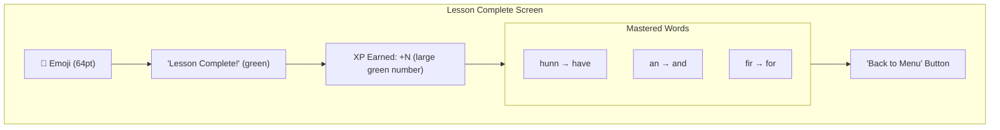

# LuxLingo Exercise Type Guide (Source of Truth)

This document is the official specification for all exercise types in the LuxLingo iOS app.
Use it as a reference for UI consistency, when implementing new logic, and when evolving templates.

**Last updated**: Alpha v3.5 (UI/UX Audit)

---

## 1. Common UI Shell

All exercises share a common shell defined in `ExerciseScreen.swift`.



### Header
- **Progress bar**: Multi-segment (blue = Intro, orange = Reinforce, green = Challenge) with a white dot indicator.
- **Phase badge**: Pill-shaped label showing current phase.
- **XP counter**: Green pill showing `⭐ N XP`.

### Action Button
- **"Got it!"** for Flashcard, **"Continue"** for Reading, **"Check"** for everything else.
- Disabled (grey) until the user provides input.
- **Skip button** appears after 3 consecutive failures.

### Feedback Banner
- **Correct (green)**: Shows "Great job!" + EN translation of the sentence.
- **Wrong (red)**: Shows "Not quite!" + **the correct answer** + EN translation.
- Contains a white "Continue" button.
- Slides up with spring animation.

### Transitions
- Exercise body slides in from the right with a fade on each new exercise.
- Animation preset: `.luxSpring` (response: 0.35, damping: 0.7).

---

## 2. Exercise Types Summary

| Type | Stage | Mastery Range | User Input | Key Data Fields |
| :--- | :--- | :--- | :--- | :--- |
| **FLASHCARD** | Introduction | 0 | Tap "Got it!" | `primary_en`, `text_lu`, `text_en` |
| **READING** | Reinforcement | 1–5 | Tap "Continue" | `text_lu`, `target_word` |
| **MCQ** | Reinforcement | 6–9 | Select + Check | `text_en`, `text_lu`, distractors |
| **MATCHING** | Reinforcement | 5–15 | Tap pairs | 4–5 sense-word pairs |
| **N_RULE_HUNTER** | Reinforcement | 8–18 | Tap to toggle | `text_lu`, `has_n_rule` |
| **ZIPF_SPEED_RUN** | Challenge | 12–25 | Swipe Left/Right | `rank_tier`, distractors |
| **JUMBLED_EN** | Challenge | 15–19 | Build sentence | `text_lu` (prompt), `text_en` (tokens) |
| **JUMBLED_LU** | Challenge | 20–24 | Build sentence | `text_en` (prompt), `text_lu` (tokens) |
| **CLOZE** | Mastery | 25+ | Type word | `text_en` (context), `text_lu` (gap) |

---

## 3. Detailed Wireframes

### FLASHCARD



**Key design decisions**:
- Card uses a `LinearGradient` from `luxGreen.opacity(0.04)` to `luxGreen.opacity(0.12)`.
- Adaptive height (`minHeight: 280`) — no fixed height to avoid clipping.
- Speaker icon hidden until TTS is implemented (avoid broken affordance).

---

### READING



**Key design decisions**:
- After tapping "Continue", the feedback banner slides up showing the English translation — this ensures the user gets a learning signal even for passive exercises.

---

### MULTIPLE CHOICE (MCQ)



**Key design decisions**:
- Sentence is in a distinct grey card to separate it visually from the tappable options.
- **Selection is decoupled from checking**: tapping an option highlights it (green border), but the user must tap "Check" to submit. This prevents accidental answers.
- On feedback: correct option shows green bg + ✓, wrong selection shows red bg + ✗.

---

### SENTENCE BUILDING (JUMBLED)



**Key design decisions**:
- Tokens preserve their **shuffled order** (not alphabetically sorted).
- When a token is used, a **ghost placeholder** stays in its position to prevent layout jumps.
- Collection zone has a **dashed border** to clearly indicate the drop target.
- Spring animations on all token movements.

---

### CLOZE (Fill-in-the-blank)



**Key design decisions**:
- Placeholder text `"type here"` provides clear affordance.
- Autocorrect and autocapitalization are **disabled** (would interfere with LUX spelling).
- Underline is **3px thick** with animated color transitions.

---

### MATCHING



**Key design decisions**:
- **Wrong match feedback**: cards briefly flash red and shake horizontally before deselecting.
- **Correct match**: both cards scale down and fade out with spring animation.
- No explicit "Check" button — completion is automatic.

---

### N-RULE HUNTER

```mermaid
graph TD
    subgraph NRULE ["N-Rule Hunter Layout"]
        Sub["Subtitle: 'Keep or Drop the \"n\"?'"]
        subgraph SentCard ["Sentence Card"]
            S1["Eist Haus ______ "]
            Toggle["[n] toggle button (purple)"]
            S2[" grouss."]
        end
        Hint["Hint: Check the next word's first letter"]
        Btn["'Check' Button"]
    end
    Sub --> SentCard --> Hint --> Btn
```

**Key design decisions**:
- The potentially droppable "n" is highlighted with a purple pill/toggle.
- Tapping cycles between `[n]` and `[_]` (empty/underscore).
- Background logic handles the complex Eifeler Regel (n is dropped before most consonants except d, h, n, t, z).

---

### ZIPF SPEED RUN



**Key design decisions**:
- High-intensity mode: user has 2 seconds per card.
- No "Check" button; input is purely gestural (swipe).
- Focused on the Top 100 words to build "instinctual" recall.

---

## 4. Lesson Summary Screen



**Key design decisions**:
- Shows human-readable word pairs (`LU → EN`) instead of internal IDs.

---

## 5. Design System Constants

| Token | Value | Usage |
|-------|-------|-------|
| `Color.luxGreen` | `#58CC02` | Primary action, correct feedback |
| `Color.luxRed` | `#FF4B4B` | Wrong feedback |
| `Color.luxAmber` | `#FFC107` | Typo / N-rule feedback |
| `Color.luxPurple` | `#CE82FF` | Accent / secondary |
| `.luxSpring` | `spring(0.35, 0.7)` | Standard UI transition |
| `.luxQuick` | `easeInOut(0.2)` | Micro-interactions |
| Card corner radius | `24pt` | Flashcard, large cards |
| Button corner radius | `12pt` | All buttons and options |
| Token corner radius | `10pt` | Jumbled word pills |
| Timer pulse speed | `2.0s` | Zipf Speed Run card duration |

---

## 6. Future Potential Exercise Types

The following ideas are reserved for future exploration to further leverage the Zipfian and Luxembourgish-specific nature of the app:

### ⚠️ Polysemy Challenge (Meaning-in-Motion)
- **Goal**: Master multiple meanings of high-frequency words (e.g., *ginn*).
- **Format**: Drag a word into 1 of 3 sentences where its usage matches a specific English meaning.

### 🌉 Connector Bridge
- **Goal**: Join sentences using frequent conjunctions (*well, fir, mä*).
- **Format**: Two clauses are shown; user picks the correct "bridge" word from a selection.

### 🌊 Audio Shadowing
- **Goal**: Natural prosody and accent reduction.
- **Format**: User listens to a native speaker and "shadows" (repeats with a 200ms delay). UI shows a pitch/timing waveform comparison.

### ⚖️ Reverse Zipf (Outlier Detection)
- **Goal**: Awareness of word utility.
- **Format**: "Spot the rare word" — select the word that doesn't belong in the current frequency tier (e.g., 3 common words, 1 rare word).

### 🌉 Multilingual Cognates
- **Goal**: Leverage German/French knowledge commonly found in Luxembourg.
- **Format**: Show a German/French sentence and have the user build the equivalent Luxembourgish sentence, highlighting shared roots.
